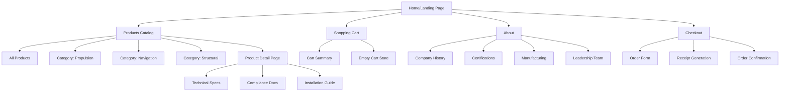
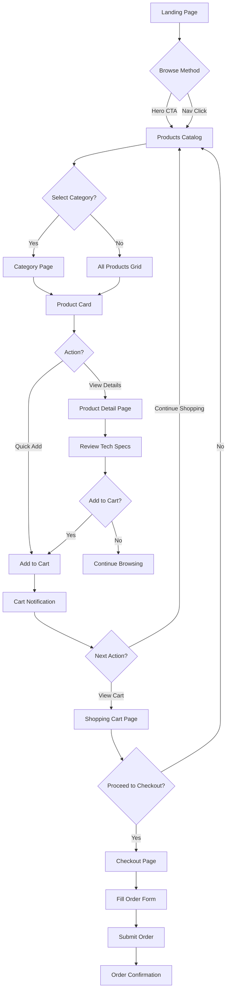
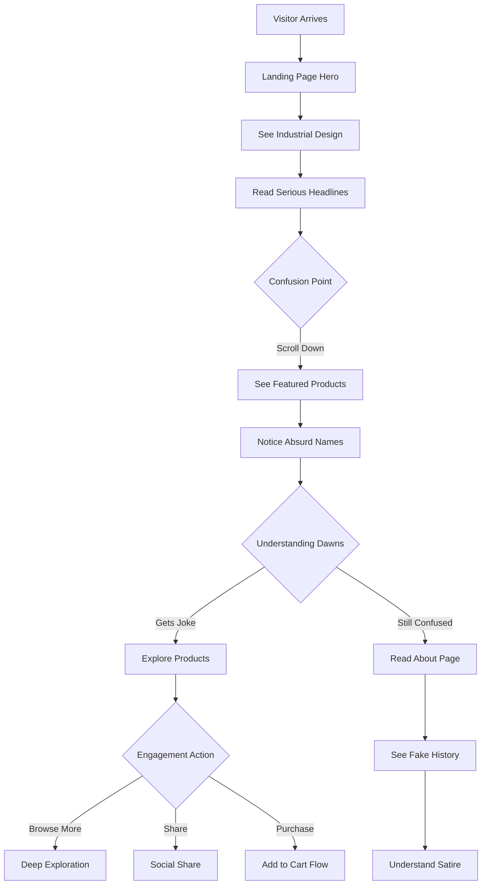
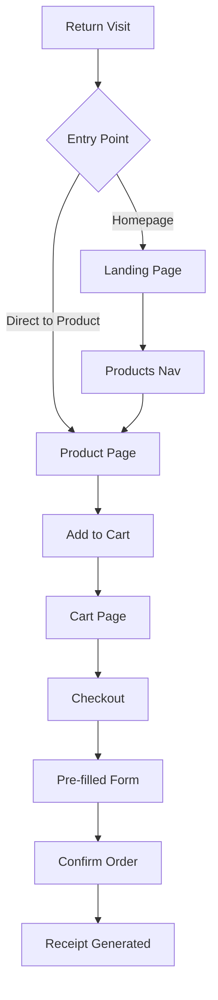

# LakeDroneBuilders UI/UX Specification

## Section 1: Introduction

This document defines the user experience goals, information architecture, user flows, and visual design specifications for LakeDroneBuilders' user interface. It serves as the foundation for visual design and frontend development, ensuring a cohesive and user-centered experience.

### 1.1 Overall UX Goals & Principles

#### Target User Personas

**1. The Serious Hobbyist Engineer**
- Technical professionals or advanced hobbyists who appreciate the humor but engage with the serious presentation
- Values detailed technical specifications (even if fictional)
- Enjoys the deadpan industrial aesthetic
- Likely to share the site with like-minded individuals

**2. The Casual Browser** 
- Discovers the site through social sharing or search
- Initially confused but then delighted by the absurdist humor
- May purchase items as gag gifts or conversation pieces
- Appreciates the high-quality presentation of fictional products

**3. The Gift Buyer**
- Looking for unique, humorous gifts for engineers or drone enthusiasts
- Values the professional presentation that makes the joke land better
- Needs clear navigation and simple checkout process
- Appreciates the industrial packaging aesthetic

#### Usability Goals

- **Discoverability through contrast**: The serious industrial UI makes the absurd products more humorous
- **Professional shopping experience**: Despite fictional products, the cart and checkout should feel legitimate
- **Quick comprehension**: Users should understand the joke within 30 seconds while still being able to shop normally
- **Shareability**: Easy to share specific products or the entire experience on social media
- **Accessibility**: Industrial theme must not compromise usability for all users

#### Design Principles

1. **Deadpan Industrial Seriousness** - Present absurd products with unwavering technical gravitas
2. **Functional Brutalism** - Every design element appears purely functional, no frivolity
3. **Over-engineered Simplicity** - Make simple actions feel like critical operations
4. **Authentic Inauthenticity** - The more genuine the industrial aesthetic, the funnier the contrast
5. **Accessible Absurdity** - Humor through design without sacrificing usability

### Change Log

| Date | Version | Description | Author |
|------|---------|-------------|--------|
| 2025-10-16 | 1.0 | Initial UI/UX specification | Sally (UX Expert) |

## Section 2: Information Architecture (IA)

### Site Map / Screen Inventory

### Navigation Structure

**Primary Navigation:** 
- Styled as an industrial control panel with steel-textured header
- Items: [INVENTORY] [REQUISITION CART] [FACILITY INFO] 
- Cart icon shows quantity badge styled as LED counter
- Mobile: Transforms to industrial drawer with riveted edges

**Secondary Navigation:** 
- Product categories displayed as technical classification tabs
- Breadcrumbs styled as hierarchical system paths (e.g., "ROOT > INVENTORY > PROPULSION > ITEM-4A7")
- Footer contains "compliance links" (Terms of Service, ISO Certifications, Export Controls)

**Breadcrumb Strategy:** 
- Always visible on product and category pages
- Styled as technical filepath display
- Uses industrial monospace font
- Shows full hierarchy with chevron separators

## Section 3: User Flows

### Flow 1: Browse and Purchase Products

**User Goal:** Find and purchase drone components from the inventory

**Entry Points:** 
- Landing page hero CTA
- Direct navigation to Products/Inventory
- Search results (if implemented)

**Success Criteria:** 
- User adds items to cart
- Completes checkout process
- Receives order confirmation

#### Flow Diagram

#### Edge Cases & Error Handling:
- Out of stock items show "Backordered - Awaiting Shipment from Facility 7"
- Invalid quantity shows "Maximum Requisition Limit Exceeded per Regulation 4.7.2"
- Cart persistence failure displays "Requisition Cache Error - Contact Procurement"
- Network errors styled as "Communication Link Severed - Attempting Reconnection"

**Notes:** All error messages maintain the industrial fiction while providing clear user guidance

### Flow 2: First-Time Visitor Discovery

**User Goal:** Understand what this site is about and explore the humor

**Entry Points:**
- Direct URL visit
- Social media link
- Search engine result

**Success Criteria:**
- User comprehends the satirical nature
- Engages with product browsing
- Shares or bookmarks site

#### Flow Diagram

#### Edge Cases & Error Handling:
- Visitor immediately leaves: Hero must communicate concept within 3 seconds
- Misunderstands as real products: Product descriptions include subtle impossibilities
- Shares before understanding: Social meta tags explain the satire
- Accessibility user: Screen reader descriptions include context clues

**Notes:** The discovery flow is critical for viral success - users must "get it" quickly but not too obviously

### Flow 3: Quick Re-order (Returning Customer)

**User Goal:** Quickly purchase previously viewed items

**Entry Points:**
- Bookmark/direct return
- Email link (if implemented)
- Browser history

**Success Criteria:**
- Rapid item location
- Fast checkout completion
- Maintained industrial immersion

#### Flow Diagram

#### Edge Cases & Error Handling:
- Cart still has old items: "Previous Requisition Draft Restored"
- Product discontinued: "Item Reclassified - See Alternative Components"
- Price changed: "Market Fluctuation Alert per Supply Chain Directive"

**Notes:** Even quick flows maintain the industrial theme without sacrificing efficiency

## Section 4: Wireframes & Mockups

**Primary Design Files:** Will be created in Figma with component library - [Figma Link Placeholder]

### Key Screen Layouts

#### 1. Landing Page / Hero Section

**Purpose:** Immediately establish the industrial theme while showcasing featured products with deadpan seriousness

**Key Elements:**
- Massive industrial header with riveted metal texture and "LAKE DRONE BUILDERS" in stencil font
- Hero tagline: "MILITARY-GRADE DRONE COMPONENTS FOR CRITICAL OPERATIONS"
- 3-4 featured products in technical blueprint frames
- Warning stripe borders and safety notices
- "BROWSE INVENTORY" CTA styled as emergency button

**Interaction Notes:** Hero products rotate every 8 seconds with mechanical transition sound. Hover states show technical readouts and spec previews.

**Design File Reference:** Figma / Page 1 / Hero Section Frame

#### 2. Products Grid (Inventory Display)

**Purpose:** Display all products in a technical catalog format that feels like a military procurement system

**Key Elements:**
- Grid of product cards with blueprint-style borders
- Each card shows: Product image in technical frame, Part number (e.g., "LDB-4A7-X"), Name in industrial font, Price as "Unit Cost", "ADD TO REQUISITION" button
- Category filter tabs styled as metal plates
- Sort dropdown designed as industrial control switch

**Interaction Notes:** Cards have subtle mechanical hover animation. Added items show "REQUISITIONED" stamp overlay.

**Design File Reference:** Figma / Page 2 / Inventory Grid Frame

#### 3. Product Detail Page

**Purpose:** Present absurd products with overwhelming technical legitimacy

**Key Elements:**
- Large product image with technical diagram overlay option
- Specifications table with nonsensical but official-sounding data
- ISO/Military certification badges (all fictional)
- "Technical Documentation" tabs (Specs, Compliance, Installation, Safety)
- Quantity selector styled as industrial counter
- "ADD TO REQUISITION" prominently placed

**Interaction Notes:** Clicking certification badges shows fake compliance certificates. Tech docs expand with Lorem Ipsum-style technical jargon.

**Design File Reference:** Figma / Page 3 / Product Detail Frame

#### 4. Shopping Cart (Requisition Form)

**Purpose:** Transform typical cart into industrial procurement interface

**Key Elements:**
- Header: "PROCUREMENT REQUISITION FORM PRF-2024"
- Items listed as line items with part numbers
- Quantity adjusters as industrial +/- controls
- Subtotal section styled as procurement calculations
- "PROCEED TO PURCHASE ORDER" button in warning yellow

**Interaction Notes:** Removing items shows "STRIKE FROM REQUISITION" with strikethrough effect. Update quantities triggers recalculation animation.

**Design File Reference:** Figma / Page 4 / Requisition Cart Frame

#### 5. About Page (Facility Information)

**Purpose:** Elaborate the fictional company history with complete seriousness

**Key Elements:**
- "Established 1987" hero with fake facility photo
- Timeline of ridiculous achievements
- Grid of certification badges (ISO 9001, MIL-SPEC, etc.)
- Leadership team with absurd titles and bios
- "Manufacturing Capabilities" section with technical diagrams

**Interaction Notes:** Timeline items expand with detailed fake history. Certification badges link to elaborate fake documents.

**Design File Reference:** Figma / Page 5 / About Frames

## Section 5: Component Library / Design System

**Design System Approach:** Custom industrial design system built on Tailwind CSS utilities, creating reusable components that maintain the military/industrial aesthetic while ensuring usability and accessibility.

### Core Components

#### 1. Industrial Button

**Purpose:** Primary interactive element styled as industrial control interface

**Variants:** 
- Primary (Warning Yellow) - For main CTAs
- Secondary (Gunmetal Gray) - For secondary actions  
- Danger (Emergency Red) - For destructive actions
- Ghost (Outlined Steel) - For tertiary actions

**States:** 
- Default: Riveted metal appearance with subtle gradient
- Hover: Mechanical depression effect with shadow
- Active: Pressed state with inner shadow
- Disabled: Faded with "INOPERATIVE" overlay
- Loading: Rotating hazard stripes

**Usage Guidelines:** Always use sentence case with technical terminology. Include icon when possible (gear, arrow, warning symbol). Minimum size 44px height for accessibility.

#### 2. Product Card

**Purpose:** Display products in technical specification format

**Variants:**
- Grid view (blueprint frame style)
- List view (procurement line item style)
- Featured (hero size with extended specs)

**States:**
- Default: Technical border with part number header
- Hover: Reveals quick specs overlay
- Selected: "REQUISITIONED" stamp appears
- Out of stock: Red "BACKORDERED" diagonal stamp

**Usage Guidelines:** Always show part number prominently. Image should have technical diagram overlay option. Price displayed as "UNIT COST: $XX.XX"

#### 3. Form Controls

**Purpose:** Data input styled as industrial control panels

**Variants:**
- Text input (metal inset field)
- Select dropdown (rotary switch style)
- Checkbox (toggle switch)
- Radio (selector dial)
- Number input (industrial counter with +/- buttons)

**States:**
- Default: Brushed metal appearance
- Focus: Orange warning outline
- Error: Red border with alert icon
- Disabled: Grayed with crosshatch pattern

**Usage Guidelines:** Labels appear as engraved metal plates above fields. Error messages styled as "ALERT:" notifications. Helper text in industrial mono font.

#### 4. Navigation Elements

**Purpose:** Wayfinding styled as industrial control systems

**Variants:**
- Primary nav (control panel buttons)
- Breadcrumbs (system path display)
- Tabs (metal plate selectors)
- Pagination (gauge-style controls)

**States:**
- Default: Brushed metal with engraved text
- Active: Illuminated with LED-style glow
- Hover: Subtle highlight effect
- Disabled: Dimmed appearance

**Usage Guidelines:** Navigation items should feel like physical controls. Active states must be clearly indicated with "power on" styling.

#### 5. Cards and Containers

**Purpose:** Content organization with industrial framing

**Variants:**
- Standard container (riveted metal frame)
- Alert box (hazard stripe border)
- Modal (blast door style)
- Accordion (technical manual style)

**States:**
- Default: Metal texture with subtle shadows
- Expanded: Hydraulic opening animation
- Collapsed: Compressed with visible header

**Usage Guidelines:** Use sparingly to avoid visual overload. Important content gets hazard striping. Modals should feel heavy and mechanical.

#### 6. Data Display Components

**Purpose:** Present information in technical formats

**Variants:**
- Tables (procurement spreadsheet style)
- Badges (certification stamps)
- Progress bars (pressure gauges)
- Stats (LED digit displays)

**States:**
- Default: Technical readout appearance
- Updated: Brief flash animation
- Error: Red alert styling

**Usage Guidelines:** Tables use alternating row colors (gray striping). Numbers in monospace font. Status indicators as LED lights.

## Section 6: Branding & Style Guide

### Visual Identity

**Brand Guidelines:** LakeDroneBuilders Industrial Design System v1.0 - "Serious Equipment for Serious Operations"

### Color Palette

| Color Type | Hex Code | Usage |
|------------|----------|--------|
| Primary | #F59E0B | Warning amber - Primary CTAs, active states, alerts |
| Secondary | #374151 | Gunmetal gray - Headers, body text, containers |
| Accent | #10B981 | Industrial green - Success states, operational indicators |
| Success | #10B981 | Confirmation messages, completed states |
| Warning | #F59E0B | Cautions, important actions, primary buttons |
| Error | #EF4444 | Error states, stop actions, critical alerts |
| Neutral | #6B7280, #9CA3AF, #D1D5DB | Text variations, borders, disabled states |

### Typography

#### Font Families
- **Primary:** "Bebas Neue" or similar industrial sans-serif for headers - conveys strength and authority
- **Secondary:** "Inter" or "Roboto" for body text - clean and readable
- **Monospace:** "Roboto Mono" for technical data, part numbers, and specifications

#### Type Scale

| Element | Size | Weight | Line Height |
|---------|------|--------|-------------|
| H1 | 48px | 700 (Bold) | 1.1 |
| H2 | 36px | 700 (Bold) | 1.2 |
| H3 | 24px | 600 (Semi) | 1.3 |
| Body | 16px | 400 (Regular) | 1.5 |
| Small | 14px | 400 (Regular) | 1.4 |

### Iconography

**Icon Library:** Custom industrial icon set based on Heroicons/Tabler Icons with modifications

**Usage Guidelines:** 
- Icons should feel like warning symbols or technical diagrams
- Consistent 2px stroke weight
- Use duotone style for important actions (warning amber + gray)
- Animate on interaction with mechanical precision
- Examples: Gear for settings, Wrench for tools, Alert triangle for warnings, Clipboard for requisitions

### Spacing & Layout

**Grid System:** 
- 12-column grid on desktop
- 8-column on tablet  
- 4-column on mobile
- 20px gutters with industrial frame borders

**Spacing Scale:**
- Base unit: 4px
- Scale: 4, 8, 12, 16, 20, 24, 32, 40, 48, 64, 80
- Components use "bolted on" spacing with visible gaps
- Sections separated by "metal plate" dividers

### Additional Brand Elements

**Textures & Patterns:**
- Brushed metal gradients: `linear-gradient(180deg, #9CA3AF 0%, #6B7280 50%, #9CA3AF 100%)`
- Diamond plate pattern for backgrounds
- Rivet shadows for depth
- Hazard stripes: 45° yellow/black for warnings

**Voice & Tone:**
- Deadly serious about absurd products
- Technical jargon mixed with impossible features
- Military/industrial terminology throughout
- No acknowledgment of satire in UI copy

**Special Effects:**
- Mechanical sounds for interactions (optional)
- Steam/hydraulic animations for transitions
- LED glow effects for active states
- Metallic shine on hover

## Section 7: Accessibility Requirements

### Compliance Target

**Standard:** WCAG 2.1 AA compliance with select AAA enhancements for critical user paths

### Key Requirements

**Visual:**
- Color contrast ratios: 
  - Normal text: 4.5:1 minimum (gunmetal on white: 7.2:1 ✓)
  - Large text: 3:1 minimum (amber on gunmetal: 4.8:1 ✓)
  - Warning buttons: Enhanced to 7:1 for critical actions
- Focus indicators: 
  - 3px amber outline with 2px offset
  - Animated "power on" glow effect
  - Visible in all color modes
- Text sizing: 
  - Minimum 16px for body text
  - Scalable up to 200% without horizontal scrolling
  - Industrial fonts tested for readability at all sizes

**Interaction:**
- Keyboard navigation: 
  - All interactive elements accessible via Tab
  - Skip links styled as "Emergency Override" buttons
  - Custom focus trap for modals ("Blast Door Sealed")
  - Arrow keys for menu navigation
- Screen reader support: 
  - Semantic HTML throughout
  - ARIA labels for industrial terminology
  - Role descriptions for custom components
  - Status announcements for cart updates
- Touch targets: 
  - Minimum 44x44px for all interactive elements
  - Extra padding on mobile for "gloved operation"
  - Spacing prevents accidental activation

**Content:**
- Alternative text: 
  - Product images: Descriptive alt text includes humor context
  - Decorative rivets/textures: Marked as decorative
  - Certification badges: Full text equivalent provided
  - Technical diagrams: Detailed descriptions available
- Heading structure: 
  - Logical h1-h6 hierarchy maintained
  - Industrial styling doesn't break structure
  - Skip navigation available
- Form labels: 
  - All inputs clearly labeled
  - Required fields marked with * and "REQUIRED"
  - Error messages associated with fields
  - Instructions provided for complex inputs

### Testing Strategy

**Automated Testing:**
- axe DevTools integrated in development
- Pa11y CLI for build pipeline
- Contrast ratio validation in design phase
- Automated keyboard navigation tests

**Manual Testing:**
- Screen reader testing (NVDA, JAWS, VoiceOver)
- Keyboard-only navigation verification
- Mobile accessibility with TalkBack/VoiceOver
- Cognitive load assessment for industrial theme

**User Testing:**
- Include users with disabilities in testing
- Specific focus on screen reader users
- Validate industrial metaphors don't confuse
- Test with users who have motor impairments

### Additional Accessibility Considerations

**Cognitive Accessibility:**
- Clear error messages despite industrial theme
- Consistent navigation patterns
- Option to disable animations
- Plain language explanations available

**Motion and Seizure Prevention:**
- Respect prefers-reduced-motion
- No flashing above 3Hz
- Pause controls for any auto-playing content
- Mechanical animations are subtle

**Industrial Theme Adaptations:**
- "Emergency Stop" button always visible (returns to home)
- High contrast mode that maintains theme
- Text-only mode available if needed
- Sound effects optional and defaulted off

## Section 8: Responsiveness Strategy

[Section Skipped]

## Section 9: Animation & Micro-interactions

### Motion Principles

**Core Philosophy: "Mechanical Precision"**
- All animations should feel mechanical and purposeful, like industrial machinery
- Timing should be precise and consistent (no organic easing)
- Sound effects optional but reinforce mechanical nature
- Performance over complexity - smooth 60fps required

**Design Principles:**
1. **Weight and Momentum** - UI elements have mass and move accordingly
2. **Mechanical Easing** - Use cubic-bezier curves that feel hydraulic/pneumatic
3. **Sequential Operations** - Complex actions broken into mechanical steps
4. **Industrial Feedback** - Every action has mechanical response
5. **Efficiency First** - No gratuitous animation, every motion has purpose

### Key Animations

- **Button Press:** Mechanical depression with inner shadow (Duration: 150ms, Easing: cubic-bezier(0.4, 0, 0.6, 1))
- **Modal Open:** Blast door sliding open from center (Duration: 300ms, Easing: cubic-bezier(0.22, 1, 0.36, 1))
- **Cart Add:** Item stamps into cart with metallic thud (Duration: 200ms, Easing: cubic-bezier(0.68, -0.55, 0.265, 1.55))
- **Page Transition:** Mechanical wipe like factory conveyor (Duration: 400ms, Easing: cubic-bezier(0.77, 0, 0.175, 1))
- **Loading State:** Rotating gear with progress indicator (Duration: Continuous, Easing: linear)
- **Error Shake:** Violent mechanical vibration (Duration: 500ms, Easing: steps(10))
- **Success Check:** LED light sequence activation (Duration: 600ms, Easing: steps(3))
- **Hover States:** Subtle power-up glow (Duration: 200ms, Easing: ease-out)
- **Accordion Expand:** Hydraulic panel extension (Duration: 250ms, Easing: cubic-bezier(0.87, 0, 0.13, 1))
- **Number Counter:** Mechanical flip counter effect (Duration: 100ms per digit, Easing: linear)

### Micro-interaction Details

**Form Interactions:**
- Input focus: Orange border illuminates like powered circuit
- Validation: Green check mark stamps with authority
- Error: Red alert light flashes with warning buzz

**Navigation Feedback:**
- Hover: Subtle LED glow beneath nav items
- Active: Mechanical click with depression
- Route change: Screen slides like monitor switching channels

**Product Interactions:**
- Image hover: Technical overlay fades in
- Quick view: Pneumatic popup with steam effect
- Add to cart: Product flies to cart with trajectory path

### Performance Guidelines

- All animations GPU-accelerated (transform, opacity only)
- Reduced motion mode: Instant transitions, no decorative motion
- Mobile: Simplified animations for better performance
- Loading: Skeleton screens with mechanical pulse

## Section 10: Performance Considerations

[Section Skipped]

## Section 11: Next Steps

### Immediate Actions

1. **Review specification with stakeholders** - Present the industrial theme concept and gather feedback on the balance between humor and usability
2. **Create high-fidelity mockups in Figma** - Start with hero section and product card components to establish visual direction
3. **Prototype key interactions** - Build clickable prototype of main user flow (browse → add to cart → checkout)
4. **Conduct usability testing** - Validate that industrial theme doesn't hinder core shopping tasks
5. **Finalize design system documentation** - Create comprehensive component library in Figma with all states and variants
6. **Prepare developer handoff** - Annotate designs with Tailwind classes and interaction specifications

### Design Handoff Checklist

- [x] All user flows documented
- [x] Component inventory complete
- [x] Accessibility requirements defined
- [x] Responsive strategy clear
- [x] Brand guidelines incorporated
- [x] Performance goals established

### Critical Design Decisions to Validate

1. **Sound effects** - Should mechanical sounds be implemented? Default on or off?
2. **Animation complexity** - Is the proposed level of mechanical animation achievable within performance budget?
3. **Mobile adaptation** - How much of the industrial theme carries to mobile without overwhelming small screens?
4. **Fake documentation depth** - How extensive should fictional technical docs be? Full PDFs or just previews?

### Handoff to Development

**For the Design Architect:**
- All components designed with Tailwind utilities in mind
- Industrial effects achievable with CSS (no heavy images)
- Animation specifications use CSS-friendly timing functions
- Accessibility baked into component designs

**For the Development Team:**
- Start with Story 1.1: Design research and documentation
- Implement base components before full pages
- Test industrial theme doesn't impact Core Web Vitals
- Ensure all animations respect prefers-reduced-motion

### Open Questions Requiring Decisions

1. Should product photography be real or illustrated technical drawings?
2. How should the cart icon indicate quantity - LED counter or traditional badge?
3. Should checkout actually process orders or just generate fake confirmations?
4. What level of product customization should fake technical specs include?

### Risk Mitigation

- **Theme overwhelming users**: Create "lite" version to A/B test
- **Performance concerns**: Prepare static version without animations
- **Accessibility issues**: Schedule testing with users with disabilities
- **Brand confusion**: Ensure social media previews clearly indicate satire

## Section 12: Checklist Results

[No UI/UX checklist was run as none was found in the dependencies]