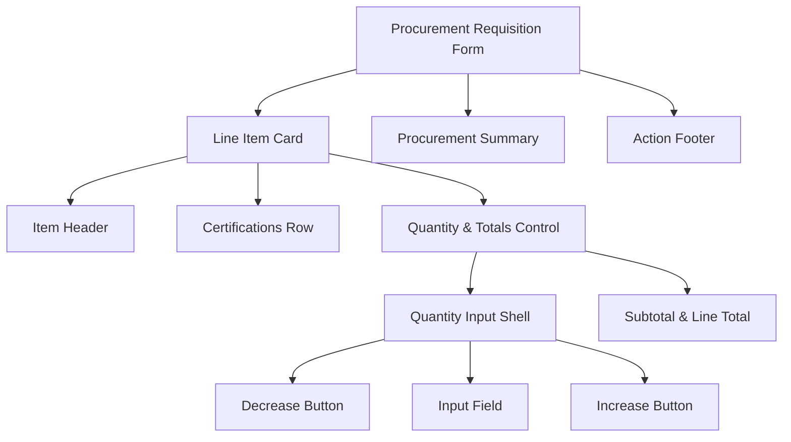
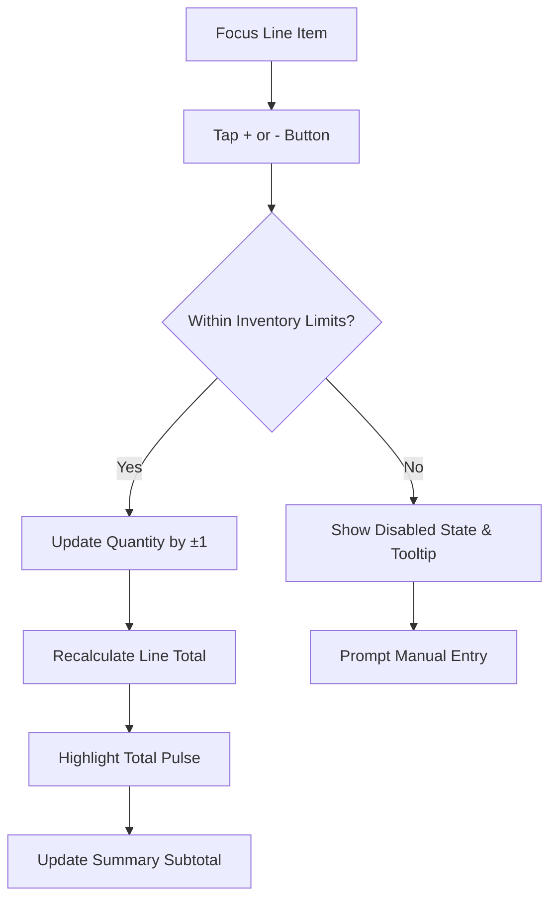
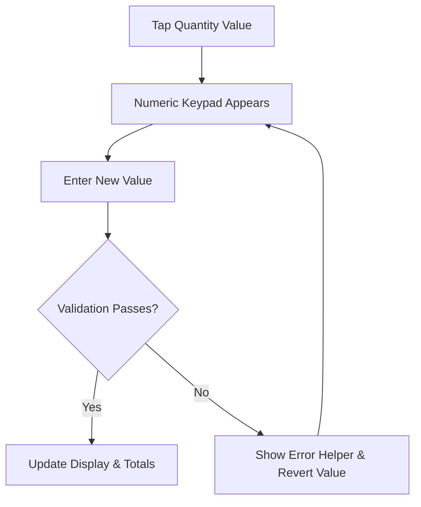

# LakeDroneBuilders – Adjust Inventory Control UI/UX Specification

## Introduction

This document defines the user experience goals, information architecture, user flows, and visual design specifications for LakeDroneBuilders' procurement requisition line item quantity control. It serves as the foundation for redesigning the inline quantity and totals region so that it remains compact on mobile while staying consistent across larger breakpoints.

### Overall UX Goals & Principles

#### Target User Personas

- **Field Procurement Specialist (Mobile-First):** Often on-site with contractors, needs thumb-friendly adjustments while seeing totals without scrolling.
- **Operations Coordinator (Dual-Device):** Splits work between desktop planning and quick mobile check-ins; expects parity across breakpoints.
- **Compliance Reviewer (Detail-Oriented):** Verifies surcharges and certification flags; requires totals and labels to stay readable even when controls compress.

#### Usability Goals

- Rapid quantity edits (≤3 taps) at mobile width without accidental over-taps.
- Line total stays fully visible alongside the control at ≤375px width.
- Clear step feedback (disabled state, reached limits) to prevent mistaken orders.
- Layout gracefully scales up to tablet/desktop without wasting space.

#### Design Principles

1. **Responsive Density:** Prioritize economy of space while keeping legibility at 12–16px text.
2. **Thumb-Zone Safety:** Primary tap targets (± buttons) sit within 44px touch targets and in opposing corners to reduce errors.
3. **Inline Feedback:** Quantity changes animate totals inline, reinforcing context without modals.
4. **Hierarchy Preservation:** Certifications and pricing remain scannable through consistent alignment and contrast.
5. **Visual Continuity:** Components reuse existing industrial tokens (steel grays, tech blues, caution yellows) to avoid re-theming debt.

### Change Log

| Date | Version | Description | Author |
| --- | --- | --- | --- |
| – | – | Initial specification draft | Sally (ux-expert) |

## Information Architecture (IA)

### Site Map / Screen Inventory

### Navigation Structure

**Primary Navigation:** Procurement workspace → active requisition  
**Secondary Navigation:** Sticky stepper (Review → Approve → Submit)  
**Breadcrumb Strategy:** Retain existing “Dashboard / Procurement / Requisition #” breadcrumb above modal.

## User Flows

### Flow 1 – Adjust Quantity on Mobile

### Flow 2 – Enter Manual Quantity (Edge Case)

## Wireframes & Mockups

**Primary Design Files:** Pending — add frame “LDB Procurement / Line Item Compact” to existing procurement design file once approved.

#### Mobile Line Item Card Layout

**Purpose:** Present compact quantity controls with live totals on 360–390px widths.  
**Key Elements:** Horizontal certification chips; stacked pricing column (unit + line total); condensed quantity bar with ± buttons; divider between item specs and pricing block.  
**Interaction Notes:** ± buttons anchored left/right with 48px tap area; quantity value centered with focus outline for manual entry; totals update with 150ms ease-out background pulse.  
**Design File Reference:** To be created; link once frame exists.

## Component Library / Design System

**Design System Approach:** Extend Industrial Design System component set; update “Quantity Inline Bar” variant with compact spec and responsive behaviors. No new global tokens required.

### Quantity Inline Bar

- **Purpose:** Provide inline ± adjustments and manual entry while showing totals context.
- **Variants:** `compact` (≤400px), `default` (tablet/desktop), `readonly`.
- **States:** default, hover (desktop), pressed, disabled min/max, error (invalid entry), loading (sync pending).
- **Usage Guidelines:** Anchor within pricing column; maintain 16px gap from totals; pair with live total label.

### Line Total Block

- **Purpose:** Present unit price and computed line total without wrapping.
- **Variants:** `stacked` (mobile two-line), `inline` (desktop single row).
- **States:** default, highlight pulse on change, warning when price override applies.
- **Usage Guidelines:** Right-align monetary values; apply `--caution-600` badge when surcharges present; keep 12px spacing below certifications row.

## Branding & Style Guide

### Visual Identity

**Brand Guidelines:** `docs/design-system/theme/industrial-design-system.md`

### Color Palette

| Color Type | Hex Code | Usage |
| --- | --- | --- |
| Primary | `#2d3136` (steel-800) | Card background, control shell |
| Secondary | `#007fff` (tech-600) | Interactive highlights, focus outline |
| Accent | `#ffb400` (caution-600) | Totals badge, surcharge callouts |
| Success | `#3dd598` | Available inventory confirmation |
| Warning | `#ff5c1a` (safety-500) | Stock limit warnings, disabled states |
| Error | `#cc2900` (safety-800) | Invalid quantity messaging |
| Neutral | `#9ca4b0`–`#c1c8d1` (steel-300/200) | Borders, divider, inactive text |

### Typography

#### Font Families

- **Primary:** Inter, -apple-system, BlinkMacSystemFont, sans-serif  
- **Secondary:** Roboto Condensed (badges, labels)  
- **Monospace:** JetBrains Mono (SKU, part numbers)

#### Type Scale

| Element | Size | Weight | Line Height |
| --- | --- | --- | --- |
| H1 | 1.5rem | 600 | 1.8 |
| H2 | 1.25rem | 600 | 1.6 |
| H3 | 1rem | 600 | 1.5 |
| Body | 0.95rem | 400 | 1.45 |
| Small | 0.75rem | 500 | 1.3 |

### Iconography

**Icon Library:** Industrial icon set  
**Usage Guidelines:** Use 16px minus/plus glyphs centered with 8px internal padding; maintain consistent stroke weight across states.

### Spacing & Layout

**Grid System:** 4px base grid with 12px mobile safe inset  
**Spacing Scale:** Use `--space-2` (8px) between control elements and `--space-3` (12px) between control bar and totals block.

## Accessibility Requirements

**Standard:** WCAG 2.2 AA + Industrial Accessibility Checklist.

### Key Requirements

**Visual:**
- Color contrast ratios: ≥4.5:1 across controls, totals, and badges.
- Focus indicators: 2px outer glow `rgba(0,127,255,0.4)` plus inner border for keyboard focus.
- Text sizing: Maintain ≥12px for badges, ≥14px for body; support 200% zoom without layout break.

**Interaction:**
- Keyboard navigation: Tabbing cycles through quantity input, then ± buttons; arrow keys adjust when input focused; totals announced via aria-live.
- Screen reader support: Announce “Quantity, current value X, increase/decrease button” with line total update.
- Touch targets: 44px minimum square with 8px separation to avoid thumb mis-tap.

**Content:**
- Alternative text: Ensure product thumbnails retain descriptive alt text; certification chips rely on text labels.
- Heading structure: Line item header remains `<h3>`; totals use `aria-labelledby` to maintain hierarchy.
- Form labels: Associate quantity input with visually hidden label “Adjust quantity”.

### Testing Strategy

Run axe-core on modal; manual NVDA verification of live region updates; measure 44px tap targets on mobile; keyboard walkthrough for ± controls; simulate color-blind modes with Color Oracle.

## Responsiveness Strategy

### Breakpoints

| Breakpoint | Min Width | Max Width | Target Devices |
| --- | --- | --- | --- |
| Mobile | 320px | 480px | iPhone SE–14 Pro, narrow Android |
| Tablet | 481px | 834px | iPad Mini/Air portrait, Surface Go |
| Desktop | 835px | 1440px | Laptops, standard monitors |
| Wide | 1441px | – | Ultra-wide procurement dashboards |

### Adaptation Patterns

**Layout Changes:** Mobile stacks quantity bar above totals with 12px gap; tablet introduces two-column grid; desktop returns to single row with balanced spacing.  
**Navigation Changes:** None required—modal header and close affordances remain unchanged.  
**Content Priority:** Certifications row collapses into horizontal scroll on mobile, expands inline on larger viewports.  
**Interaction Changes:** Mobile uses full-width buttons with larger padding; desktop adds hover states and keyboard shortcut (Shift+Arrow adjusts by 5).

## Animation & Micro-interactions

### Motion Principles

Adopt restrained industrial motion: durations <200ms, `cubic-bezier(0.16, 1, 0.3, 1)` ease-out on releases, disable embellishments when `prefers-reduced-motion` is true.

### Key Animations

- **Quantity Button Press:** Compress 2px on press with 120ms ease-in; spring back over 180ms. Disable animation when reduced motion requested.
- **Total Update Pulse:** Line total background tint `rgba(0,127,255,0.12)` fades in 150ms/out 200ms to communicate recalculation.
- **Error Shake:** Invalid manual entry triggers 8px horizontal shake (3 oscillations, 220ms) with safety red shadow; fall back to color change only when reduced motion active.

## Performance Considerations

### Performance Goals

- **Page Load:** Maintain requisition modal LCP ≤ 3.5s (no regression expected).  
- **Interaction Response:** Quantity adjustments reflect in totals within 150ms.  
- **Animation FPS:** Sustain 60fps on mobile during pulses.

### Design Strategies

Precompute line totals within client store; use CSS transforms for animations to avoid layout thrash; debounce manual entry validation; lazy-load large certification imagery to keep interaction snappy.

## Next Steps

### Immediate Actions

1. Review spec with Procurement product owner to confirm compliance nuances.
2. Create Figma frame “LDB Procurement / Line Item Compact” using tokens in this doc.
3. Align with dev lead on Design System updates for `Quantity Inline Bar` component.
4. Schedule QA accessibility regression once implementation is ready.

### Design Handoff Checklist

- [ ] All user flows documented (pending stakeholder sign-off)
- [ ] Component inventory complete (pending Design System ticket creation)
- [x] Accessibility requirements defined
- [x] Responsive strategy clear
- [x] Brand guidelines incorporated
- [x] Performance goals established

## Checklist Results

No dedicated UI/UX checklist executed yet; run industrial accessibility checklist after Figma frame approval.
